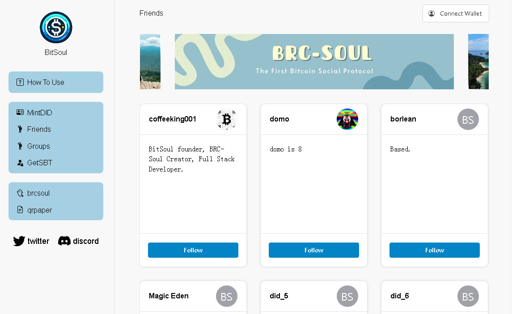

# bit-soul

## What
BitSoul is trying to build a de-social network based on BitCoin, the most secure blockchain.
<https://dapp.bitsoul.xyz>

## How
Here is the help document about how to use bitsoul: <https://bitsoul.medium.com>

## Why
The lack of regulation in the crypto space brings freedom but also comes with scams.
Addressing trust issues in anonymous scenarios becomes crucial. This can significantly
reduce trust costs and, consequently, increase productivity in the crypto world.
[BRC-Soul Protocol based on BitCoin](https://github.com/bit-soul/brc-soul) can effectively
solve decentralized trust issues and have important applications in scenarios such as:

1. Lending platforms can adjust corresponding collateral ratios based on the credibility of addresses, thereby improving capital utilization efficiency.
2. Individuals can assess the credibility of a project based on the reputation of the project initiator's address and decide whether to invest or not.
3. Individuals can develop their social circles in the crypto world based on the credibility of addresses.
4. The decentralized relationship can be stored on the chain forever, without restriction of any centralized app.
5. Every app use the same data, we would never need build our social network and reputation again and again.
6. and so on...

Why should use the Bitcoin chain?
1. Applications on Bitcoin are just emerging, and there is currently no related protocol for a DID identity system. This is an important area in the crypto community.
2. Bitcoin is currently the most secure chain, and personal identity information is the most important information for everyone, so it should be stored on the most secure chain.
3. The various DID identity systems on different chains have caused severe fragmentation in the ecosystem. Bitcoin's position is the most hopeful for standardizing DID identity systems.

### RoadMap
1. Develop Discord Bot to sync group relation to Discord
2. Develop Chrome plugin to sync follow relation to Twitter 
3. Use Rollup Tech to reduce operation time to one-second
4. Raise funds to give grants to the project who use BRC-Soul protocol

## Contact us
1. issues: <https://github.com/bit-soul/bit-soul/issues>
2. email: <coffeeking001@outlook.com>
3. medium: <https://bitsoul.medium.com>
4. telegram: <https://t.me/bitsoul_xyz>
5. discord: <https://discord.gg/3MjNRBhuRv>
6. twitter: <https://twitter.com/bitsoul_xyz>